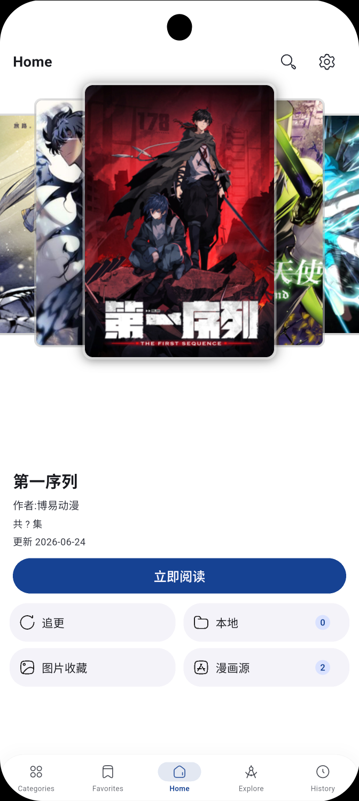
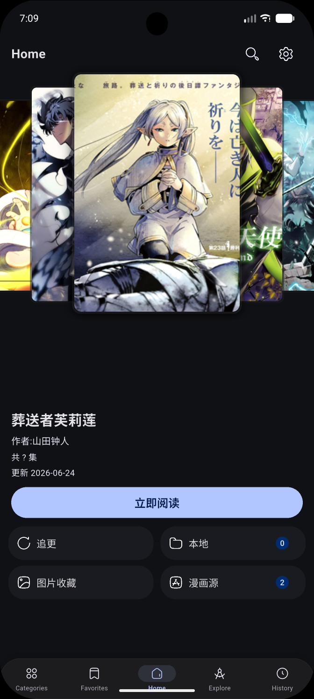

# KongComic

> A comic reader based on [venera-app/venera](https://github.com/venera-app/venera), deeply modified by AI (Reasonix)

[](https://flutter.dev/)
[](LICENSE)
[](https://github.com/SkyAlice-source/KongComic-android/releases)

---

## 📖 Introduction

KongComic is a comic reader supporting multi-source search, local favorites, and online reading. It is a deep secondary development of the [Venera](https://github.com/venera-app/venera) project by AI.

<div align="center">
  
  &nbsp;&nbsp;
  
  <br/>
  <em>Home page — light theme (left) and dark theme (right)</em>
</div>

---

## 🆕 What's New in v1.1.0

### 🐛 Bug Fixes
- **Swipe-back gesture restored on side pages** — Removed conflicting `GestureDetector(onHorizontalDragEnd)` from `SideBarRoute`; the fork's custom gesture competed with Android's predictive back, requiring 2–3 swipes to pop. The route now uses Venera's standard click-absorber pattern, swipe-back works on the first attempt (comments, download page, etc.)
- **Download settings page crash** — Added missing default value for `deleteFolderAfterCbz` in `appdata.dart`; opening download settings no longer throws an `assert` on `null`
- **Download status wrongly shows "Paused" on error** — `buildTop()` now checks `isError` before `isPaused`, so failed downloads correctly display "Error" instead of "Paused"
- **Duplicate Language entry in Settings** — Removed the legacy hardcoded Language picker from the APP settings page; the "Appearance → Language" entry is now the only one (with proper translations and live reload)

### 🎨 UI & UX Improvements
- **Download settings page refactored** — Section headers ("CBZ Packaging" / "Download Performance"), conditional visibility of `deleteFolderAfterCbz` (only shown when CBZ is enabled), thread-count hint
- **Settings page two-pane mode polish** — Selected category uses `primary.withValues(alpha: 0.3)` border, `cs.primary` icon color, `cs.onSurface` title — clearer focus indicator

### 🚀 Performance
- **Async I/O in download pipeline** — `existsSync` / `deleteSync` / `writeAsBytesSync` replaced with async equivalents; CBZ packaging and cover writes no longer block the UI thread

---

## 🆕 What's New in v1.0.5

### 🚀 Performance & Optimization
- **Reader image preload concurrency control** — Semaphore limits to 3 concurrent loads, preventing OOM crashes
- **Download I/O moved to async** — `writeAsBytesSync` replaced with async `writeAsBytes`, UI thread no longer blocked
- **Download progress notification throttling** — `notifyListeners()` throttled to max 1 per 500ms, reducing unnecessary rebuilds
- **Search suggestions optimized** — Prefix index (`_searchIndex`) replaces full linear scan, significantly faster on large tag dictionaries
- **Image loading concurrency control** — `CachedImageProvider` uses semaphore instead of polling, more efficient
- **App init priority split** — Critical path (UI rendering) separated from deferred path (tags, OpenCC), faster first frame
- **History cache LRU** — FIFO → LRU, cache size 10 → 20, fewer cache misses
- **`forceRebuild()` optimized** — Simplified to `setState(() {})`, leverages Flutter diffing

### 🎨 UI & UX Improvements
- **Tag color contrast fix** — Title tags now use `useTextColor()` for proper dark mode contrast; tag values use `primaryContainer` for better visibility
- **Chapter list color optimization** — Current reading chapter highlighted with `primaryContainer` + bold; read chapters use `onSurfaceVariant` instead of `outline`; normal/grouped chapters visually distinguished
- **Home page pull-to-refresh** — `RefreshIndicator` added to home page, Banner reloads on refresh
- **Home timer fix** — Removed recursive `_startTimer()` call inside `Timer.periodic` callback, preventing timer leak

### 🐛 Bug Fixes
- **Home timer not properly cancelled** — `_startTimer()` now cancels previous timer before creating a new one
- **`forceRebuild()` performance issue** — Removed full Element tree traversal, now uses `setState`

---

## ✨ Features

### 🏠 Home
- Banner card carousel with auto-switching
- Comic info panel: title, author, reading progress, total episodes, "Read Now" button
- Quick access: Follow Updates, Local, Image Favorites, Comic Source

### 🗺 Navigation
- 5 tabs: Categories / Favorites / Home / Explore / History
- Active state: purple circle + purple icon + bold text
- Floating glass bottom bar with rounded corners

### 🔍 Search
- Multi-source search + aggregated search
- ID direct jump
- Tag suggestions with debounce
- Search history with individual deletion

### 📚 Settings
- 9 categories: Reader / Appearance / Explore / Favorites / Network / Download / Import / General / About
- Sorted by usage frequency
- Language selector (System / Chinese / Traditional Chinese / English)

### 🎨 UI
- Geist-inspired flat design
- HugeIcons (5000+ line icons) replacing all FluentIcons/Material Icons
- Light/Dark dual theme

### 📖 Reader
- Touch to turn pages (30% left/right zones, 40% center menu)
- Progress bar with ShaderMask dual-color text

### 📦 Backup & Restore
- Export/import includes: history, favorites, settings, cookies, source scripts, and custom covers

---

## 🔧 Build

```bash
unset FLUTTER_STORAGE_BASE_URL
unset PUB_HOSTED_URL
flutter pub get
flutter build apk --release --android-skip-build-dependency-validation
```

Output: `build/app/outputs/flutter-apk/KongComic-{version}-{abi}.apk`

### Architectures
| APK | Size | Target |
|-----|------|--------|
| `arm64-v8a` | ~17 MB | Modern Android phones |
| `armeabi-v7a` | ~16 MB | Older Android devices |
| `x86_64` | ~17 MB | Emulators / Tablets |
| `universal` | ~41 MB | All architectures |

---

## 🙏 Credits

- [Venera](https://github.com/venera-app/venera) — Original project by [@wgh136](https://github.com/wgh136)
- [Reasonix](https://reasonix.ai) — AI coding assistant
- All open-source dependency maintainers

---

## 📄 License

[GPL-3.0](LICENSE)
